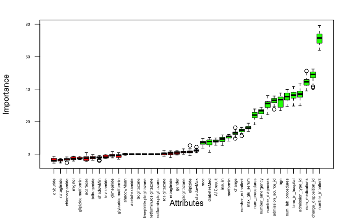
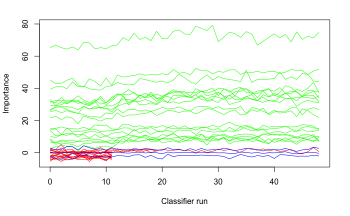
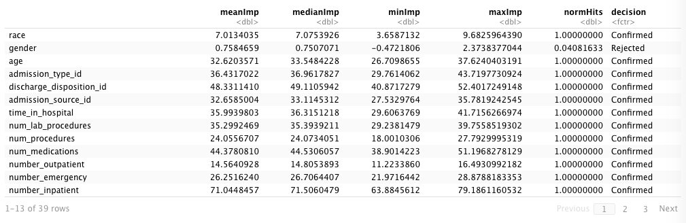
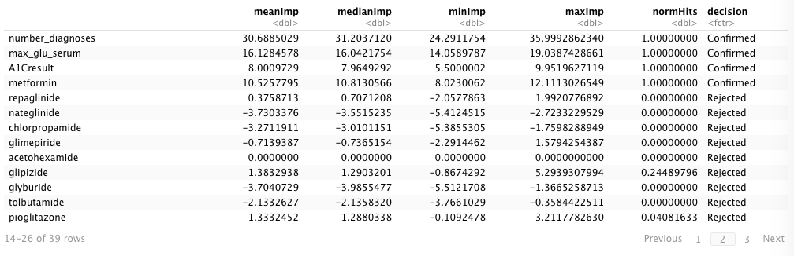
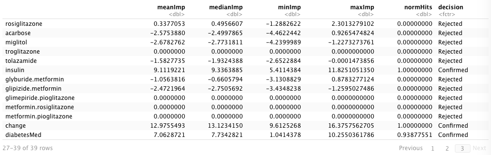

# Assignment 2 - Nathaniel Wise

# Patient Readmission Rates

```{r setup, include=FALSE}
knitr::opts_chunk$set(echo = TRUE)
knitr::opts_knit$set(root.dir = '~/DataScienceMS/Applied Data Science/Data')
```

```{r customize output, include = FALSE}
# /*****************************************************************************
# *    Reference
# *    Title: Showing only the first few lines of the results of a code chunk
# *    Author: andrie
# *    Date: April 2018
# *    Code version: NA
# *    Availability: https://community.rstudio.com/t/showing-only-the-first-few-
# *    lines-of-the-results-of-a-code-chunk/6963
# *
# ******************************************************************************
library(knitr)
hook_output <- knit_hooks$get("output")
knit_hooks$set(output = function(x, options) {
  lines <- options$output.lines
  if (is.null(lines)) {
    return(hook_output(x, options))  # pass to default hook
  }
  x <- unlist(strsplit(x, "\n"))
  more <- "..."
  if (length(lines)==1) {        # first n lines
    if (length(x) > lines) {
      # truncate the output, but add ....
      x <- c(head(x, lines), more)
    }
  } else {
    x <- c(more, x[lines], more)
  }
  # paste these lines together
  x <- paste(c(x, ""), collapse = "\n")
  hook_output(x, options)
})
``` 


Through this assignment, we explore patient readmission rates using data obtained from the UCI Machine Learning Repository. The dataset spans 10 years (1999-2008) across 130 hospitals and includes 55 attributes containing information about the patient's hospital experience (hospital location, diagnosis, test results, etc.), patient demographics, and medications prescribed.  

To begin this investigation, we perform an Exploratory Data Analysis & Visualization, Clustering - to examine feature similarity, and Factor Analysis - to examine which attributes are better in the prediction of a patient being readmitted to a hospital. 

## Setup

```{r Library Installs, echo=T, message = F, warning = F, results='hide'}
library(bestglm)
library(Boruta)
library(caret)
library(dplyr)
library(fastDummies)
library(ggplot2)
library(leaps)
library(naniar)
library(purrr)
library(viridis)
```

```{r Set Seed and Data Import}
set.seed(004)

df <- read.csv("diabetic_data.csv",header = TRUE)
```

## Task 1 EDA 

```{r EDA - Data Structure}
#Examine structure of data
str(df)
```

```{r EDA - Data Levels, output.lines = 10}
#Check levels across data frame
#Output truncated on Knit file to save space. 
df %>% 
  dplyr::mutate_all(as.factor) %>% 
    purrr::map(levels)
```


```{r EDA - Duplicate Values}
#Find if we have any duplicate results
sum(duplicated(df))
```

```{r EDA - Replace ? Values}
#Replace ? values with NA
df2 <- df %>% dplyr::na_if("?")
```

```{r EDA - Missing Values}
#Observe Missing Values among variables
gg_miss_var(df2)
```


```{r EDA - Recode NA Values}
# /*****************************************************************************
# *    Reference
# *    Title: Predicting Hospital Readmission of Diabetics
# *    Author: CC
# *    Date: May 2021
# *    Code version: Version 9
# *    Availability: 
# *     https://www.kaggle.com/chongchong33/predicting-hospital-readmission-of-
# *     diabetics
# *
# ******************************************************************************

#categorize "readmitted"
#1 --patient was readmitted within 30 days 
#0-- readmission after 30 days and no readmission

df2$readmitted <- case_when(df2$readmitted %in% c(">30","NO") ~ "0",
                              TRUE ~ "1")
df2$readmitted <- as.factor(df2$readmitted)
levels(df2$readmitted)

```


```{r EDA - Readmission Count}
#Calculate readmission rates
sum(df2$readmitted == 1)/sum(df2$readmitted == 0)

#Visualize readmission rates
ggplot(df2, aes(x = readmitted)) + 
  geom_bar(fill = "darkorchid4") +
  ggtitle("Readmission Count")
```

```{r EDA - Readmissions by Diabetes Medication}
#Visualizing readmissions based on if patient was taking diabetes medications
ggplot(df2, aes(x=diabetesMed, fill = readmitted)) +
  geom_bar() +
  scale_fill_viridis(discrete = TRUE) +
  ggtitle("Patients with Diabetes Medications")

ggplot(df2, aes(x=diabetesMed, fill = readmitted)) +
  geom_bar(position = "fill") +
  scale_fill_viridis(discrete = TRUE) +
  ggtitle("Patients with Diabetes Medications")

```

```{r EDA - Readmissions by Admission Type}
#Visualizing readmissions based on admission type
ggplot(df2, aes(x=admission_type_id, fill = readmitted)) +
  geom_bar() +
  scale_x_discrete(limits=c("1" = "1", "2" = "2","3" = "3","4" = "4","5" = "5",
                            "6" = "6","7" = "7","8" = "8")) +
  scale_fill_viridis(discrete = TRUE) +
  ggtitle("Readmission Rates Admission Type") 


ggplot(df2, aes(x=admission_type_id, fill = readmitted)) +
  geom_bar(position = "fill") +
  scale_x_discrete(limits=c("1" = "1", "2" = "2","3" = "3","4" = "4","5" = "5",
                            "6" = "6","7" = "7","8" = "8")) +
  scale_fill_viridis(discrete = TRUE) +
  ggtitle("Readmission Rates Admission Type") 
```

```{r EDA - Readmissions by Age}
#Visualizing readmissions based on age
ggplot(df2, aes(x=age, fill = readmitted)) +
  geom_bar() +
  scale_fill_viridis(discrete = TRUE) +
  ggtitle("Readmission Rates by Age")

ggplot(df2, aes(x = age, fill = readmitted)) +
  geom_bar(position = "fill") +
  scale_fill_viridis(discrete = TRUE) +
  ggtitle("Readmission Rates by Age")
```

```{r EDA - Readmissions by Race}
#Visualizing readmissions based on race
ggplot(df2, aes(x = race, fill = readmitted)) +
  geom_bar() +
  scale_fill_viridis(discrete = TRUE) +
  ggtitle("Readmission Rates by Race")

ggplot(df2, aes(x = race, fill = readmitted)) +
  geom_bar(position = "fill") +
  scale_fill_viridis(discrete = TRUE) +
  ggtitle("Readmission Rates by Race")
```


### Finding 1

We began our tasks by performing an exploratory analysis, first examining the structure of our data and then examining the unique levels to each attribute in our data frame, finding NA values are coded as ? and most of our attributes are character or integer types. We also find that two medications named “Citoglipton” and “Examide” have only one distinct value in their levels. No duplicate rows were found in the data frame. 

Missing values were changed from ? to NA, and then the amount of missing values in each attribute were calculated. Weight was missing in almost all records, while Payer code and Medical specialty had over 40% of their values missing. 

Readmission rates were coded as <30, >30 or NO. To explore and predict the readmissions that occur the soonest after discharge, >30 and NO were recoded to  0 and <30 as 1. Creating a visualization and examining the number of readmissions, we find that 12.6% of the records were readmitted within 30 days. Patient attributes and demographics were then explored.

The first attributes compared to readmission rates were DiabetesMed, if a patient was taking a diabetes medication and Admission type. A large portion of our data frame were taking Diabetes medications as admitted as with Admission type 1. Exploring the proportions of those readmitted among DiabetesMed and Admission type, we saw no large differences between the populations. 

Finally readmissions were explored by race and age. Most readmissions occured among the caucasion population, but proportionally, there did not appear to be many differences between races. The age range with the most readmissions were patients between 70-80, but proportionally the 20-30 age range had the highest readmissions while those under 20 had very low proportions of patients readmitted.

From the insights obtained in our data, we continue our analysis, beginning with cleaning and feature selection.

## Task 2 - Data Cleaning and Feature Selection

````{r Data Cleaning - Factorizaton and Attribute Selection}
#Change columns with character type to factor
df2 <- df2%>%
    mutate_if(is.character,as.factor)

#Create ordered factor for age
df2$age = as.ordered(df2$age)

#Remove unwanted columns
df2 = subset(df2, select = -c(encounter_id,patient_nbr,diag_1,diag_2,diag_3,
                              weight,payer_code,medical_specialty,examide,
                              citoglipton))

#Remove NA values
df2 = na.omit(df2)
```


```{r Feature Selection, eval=FALSE}
# /***************************************************************************************
# *    Reference
# *    Title: Predicting Hospital Readmission of Diabetics
# *    Author: CC
# *    Date: May 2021
# *    Code version: Version 9
# *    Availability: https://www.kaggle.com/chongchong33/predicting-hospital-
# *    readmission-of-diabetics
# *
# ***************************************************************************************/

#Code chunk not run during knit due to the long run time. Thie results of this 
#chunk have been saved as images and posted below.

boruta <- Boruta(readmitted ~., data = df2, doTrace = 2)
plot(boruta, las = 2, cex.axis = 0.5)
plotImpHistory(boruta)
attStats(boruta)
boruta

```
 1. run of importance source...
Growing trees.. Progress: 25%. Estimated remaining time: 1 minute, 33 seconds.
Growing trees.. Progress: 49%. Estimated remaining time: 1 minute, 5 seconds.
Growing trees.. Progress: 71%. Estimated remaining time: 39 seconds.
Growing trees.. Progress: 92%. Estimated remaining time: 11 seconds.
Computing permutation importance.. Progress: 6%. Estimated remaining time: 8 minutes, 55 seconds.
Computing permutation importance.. Progress: 11%. Estimated remaining time: 8 minutes, 32 seconds.
Computing permutation importance.. Progress: 17%. Estimated remaining time: 7 minutes, 46 seconds.
Computing permutation importance.. Progress: 23%. Estimated remaining time: 7 minutes, 5 seconds.
Computing permutation importance.. Progress: 30%. Estimated remaining time: 6 minutes, 25 seconds.
Computing permutation importance.. Progress: 36%. Estimated remaining time: 5 minutes, 49 seconds.
Computing permutation importance.. Progress: 42%. Estimated remaining time: 5 minutes, 13 seconds.
Computing permutation importance.. Progress: 48%. Estimated remaining time: 4 minutes, 37 seconds.
Computing permutation importance.. Progress: 54%. Estimated remaining time: 4 minutes, 2 seconds.
Computing permutation importance.. Progress: 60%. Estimated remaining time: 3 minutes, 31 seconds.
Computing permutation importance.. Progress: 67%. Estimated remaining time: 2 minutes, 55 seconds.
Computing permutation importance.. Progress: 73%. Estimated remaining time: 2 minutes, 21 seconds.
Computing permutation importance.. Progress: 80%. Estimated remaining time: 1 minute, 47 seconds.
Computing permutation importance.. Progress: 86%. Estimated remaining time: 1 minute, 13 seconds.
Computing permutation importance.. Progress: 92%. Estimated remaining time: 40 seconds.
Computing permutation importance.. Progress: 99%. Estimated remaining time: 6 seconds.
 2. run of importance source...
Growing trees.. Progress: 22%. Estimated remaining time: 1 minute, 51 seconds.
Growing trees.. Progress: 46%. Estimated remaining time: 1 minute, 13 seconds.
Growing trees.. Progress: 70%. Estimated remaining time: 40 seconds.
Growing trees.. Progress: 94%. Estimated remaining time: 7 seconds.
Computing permutation importance.. Progress: 6%. Estimated remaining time: 8 minutes, 39 seconds.
Computing permutation importance.. Progress: 12%. Estimated remaining time: 7 minutes, 47 seconds.
Computing permutation importance.. Progress: 19%. Estimated remaining time: 7 minutes, 8 seconds.
Computing permutation importance.. Progress: 25%. Estimated remaining time: 6 minutes, 33 seconds.
Computing permutation importance.. Progress: 31%. Estimated remaining time: 5 minutes, 58 seconds.
Computing permutation importance.. Progress: 38%. Estimated remaining time: 5 minutes, 24 seconds.
Computing permutation importance.. Progress: 44%. Estimated remaining time: 4 minutes, 49 seconds.
Computing permutation importance.. Progress: 50%. Estimated remaining time: 4 minutes, 21 seconds.
Computing permutation importance.. Progress: 56%. Estimated remaining time: 3 minutes, 48 seconds.
Computing permutation importance.. Progress: 62%. Estimated remaining time: 3 minutes, 15 seconds.
Computing permutation importance.. Progress: 68%. Estimated remaining time: 2 minutes, 45 seconds.
Computing permutation importance.. Progress: 75%. Estimated remaining time: 2 minutes, 11 seconds.
Computing permutation importance.. Progress: 82%. Estimated remaining time: 1 minute, 32 seconds.
Computing permutation importance.. Progress: 89%. Estimated remaining time: 54 seconds.
Computing permutation importance.. Progress: 96%. Estimated remaining time: 18 seconds.
 3. run of importance source...
Growing trees.. Progress: 26%. Estimated remaining time: 1 minute, 27 seconds.
Growing trees.. Progress: 53%. Estimated remaining time: 55 seconds.
Growing trees.. Progress: 80%. Estimated remaining time: 23 seconds.
Computing permutation importance.. Progress: 7%. Estimated remaining time: 6 minutes, 40 seconds.
Computing permutation importance.. Progress: 15%. Estimated remaining time: 5 minutes, 51 seconds.
Computing permutation importance.. Progress: 23%. Estimated remaining time: 5 minutes, 14 seconds.
Computing permutation importance.. Progress: 32%. Estimated remaining time: 4 minutes, 34 seconds.
Computing permutation importance.. Progress: 40%. Estimated remaining time: 3 minutes, 58 seconds.
Computing permutation importance.. Progress: 48%. Estimated remaining time: 3 minutes, 25 seconds.
Computing permutation importance.. Progress: 57%. Estimated remaining time: 2 minutes, 48 seconds.
Computing permutation importance.. Progress: 66%. Estimated remaining time: 2 minutes, 13 seconds.
Computing permutation importance.. Progress: 74%. Estimated remaining time: 1 minute, 41 seconds.
Computing permutation importance.. Progress: 82%. Estimated remaining time: 1 minute, 9 seconds.
Computing permutation importance.. Progress: 91%. Estimated remaining time: 36 seconds.
Computing permutation importance.. Progress: 99%. Estimated remaining time: 4 seconds.
 4. run of importance source...
Growing trees.. Progress: 27%. Estimated remaining time: 1 minute, 25 seconds.
Growing trees.. Progress: 54%. Estimated remaining time: 52 seconds.
Growing trees.. Progress: 81%. Estimated remaining time: 21 seconds.
Computing permutation importance.. Progress: 8%. Estimated remaining time: 5 minutes, 58 seconds.
Computing permutation importance.. Progress: 17%. Estimated remaining time: 5 minutes, 11 seconds.
Computing permutation importance.. Progress: 24%. Estimated remaining time: 4 minutes, 57 seconds.
Computing permutation importance.. Progress: 30%. Estimated remaining time: 4 minutes, 56 seconds.
Computing permutation importance.. Progress: 35%. Estimated remaining time: 5 minutes, 0 seconds.
Computing permutation importance.. Progress: 40%. Estimated remaining time: 4 minutes, 45 seconds.
Computing permutation importance.. Progress: 45%. Estimated remaining time: 4 minutes, 26 seconds.
Computing permutation importance.. Progress: 51%. Estimated remaining time: 3 minutes, 59 seconds.
Computing permutation importance.. Progress: 58%. Estimated remaining time: 3 minutes, 23 seconds.
Computing permutation importance.. Progress: 65%. Estimated remaining time: 2 minutes, 50 seconds.
Computing permutation importance.. Progress: 72%. Estimated remaining time: 2 minutes, 16 seconds.
Computing permutation importance.. Progress: 79%. Estimated remaining time: 1 minute, 43 seconds.
Computing permutation importance.. Progress: 85%. Estimated remaining time: 1 minute, 10 seconds.
Computing permutation importance.. Progress: 92%. Estimated remaining time: 37 seconds.
Computing permutation importance.. Progress: 99%. Estimated remaining time: 4 seconds.
 5. run of importance source...
Growing trees.. Progress: 26%. Estimated remaining time: 1 minute, 30 seconds.
Growing trees.. Progress: 51%. Estimated remaining time: 58 seconds.
Growing trees.. Progress: 77%. Estimated remaining time: 27 seconds.
Computing permutation importance.. Progress: 7%. Estimated remaining time: 7 minutes, 32 seconds.
Computing permutation importance.. Progress: 14%. Estimated remaining time: 6 minutes, 46 seconds.
Computing permutation importance.. Progress: 21%. Estimated remaining time: 6 minutes, 8 seconds.
Computing permutation importance.. Progress: 28%. Estimated remaining time: 5 minutes, 33 seconds.
Computing permutation importance.. Progress: 35%. Estimated remaining time: 4 minutes, 58 seconds.
Computing permutation importance.. Progress: 42%. Estimated remaining time: 4 minutes, 30 seconds.
Computing permutation importance.. Progress: 49%. Estimated remaining time: 3 minutes, 57 seconds.
Computing permutation importance.. Progress: 56%. Estimated remaining time: 3 minutes, 22 seconds.
Computing permutation importance.. Progress: 63%. Estimated remaining time: 2 minutes, 49 seconds.
Computing permutation importance.. Progress: 70%. Estimated remaining time: 2 minutes, 16 seconds.
Computing permutation importance.. Progress: 77%. Estimated remaining time: 1 minute, 46 seconds.
Computing permutation importance.. Progress: 84%. Estimated remaining time: 1 minute, 12 seconds.
Computing permutation importance.. Progress: 91%. Estimated remaining time: 41 seconds.
Computing permutation importance.. Progress: 98%. Estimated remaining time: 10 seconds.
 6. run of importance source...
Growing trees.. Progress: 25%. Estimated remaining time: 1 minute, 32 seconds.
Growing trees.. Progress: 51%. Estimated remaining time: 59 seconds.
Growing trees.. Progress: 77%. Estimated remaining time: 27 seconds.
Computing permutation importance.. Progress: 8%. Estimated remaining time: 6 minutes, 9 seconds.
Computing permutation importance.. Progress: 17%. Estimated remaining time: 5 minutes, 22 seconds.
Computing permutation importance.. Progress: 25%. Estimated remaining time: 4 minutes, 47 seconds.
Computing permutation importance.. Progress: 33%. Estimated remaining time: 4 minutes, 19 seconds.
Computing permutation importance.. Progress: 41%. Estimated remaining time: 3 minutes, 48 seconds.
Computing permutation importance.. Progress: 48%. Estimated remaining time: 3 minutes, 30 seconds.
Computing permutation importance.. Progress: 55%. Estimated remaining time: 3 minutes, 0 seconds.
Computing permutation importance.. Progress: 63%. Estimated remaining time: 2 minutes, 31 seconds.
Computing permutation importance.. Progress: 70%. Estimated remaining time: 2 minutes, 2 seconds.
Computing permutation importance.. Progress: 78%. Estimated remaining time: 1 minute, 31 seconds.
Computing permutation importance.. Progress: 85%. Estimated remaining time: 1 minute, 2 seconds.
Computing permutation importance.. Progress: 92%. Estimated remaining time: 31 seconds.
Computing permutation importance.. Progress: 100%. Estimated remaining time: 0 seconds.
 7. run of importance source...
Growing trees.. Progress: 26%. Estimated remaining time: 1 minute, 26 seconds.
Growing trees.. Progress: 53%. Estimated remaining time: 54 seconds.
Growing trees.. Progress: 80%. Estimated remaining time: 22 seconds.
Computing permutation importance.. Progress: 7%. Estimated remaining time: 7 minutes, 18 seconds.
Computing permutation importance.. Progress: 14%. Estimated remaining time: 6 minutes, 20 seconds.
Computing permutation importance.. Progress: 21%. Estimated remaining time: 5 minutes, 41 seconds.
Computing permutation importance.. Progress: 28%. Estimated remaining time: 5 minutes, 20 seconds.
Computing permutation importance.. Progress: 35%. Estimated remaining time: 4 minutes, 48 seconds.
Computing permutation importance.. Progress: 43%. Estimated remaining time: 4 minutes, 16 seconds.
Computing permutation importance.. Progress: 50%. Estimated remaining time: 3 minutes, 44 seconds.
Computing permutation importance.. Progress: 56%. Estimated remaining time: 3 minutes, 16 seconds.
Computing permutation importance.. Progress: 64%. Estimated remaining time: 2 minutes, 41 seconds.
Computing permutation importance.. Progress: 72%. Estimated remaining time: 2 minutes, 2 seconds.
Computing permutation importance.. Progress: 80%. Estimated remaining time: 1 minute, 25 seconds.
Computing permutation importance.. Progress: 89%. Estimated remaining time: 47 seconds.
Computing permutation importance.. Progress: 97%. Estimated remaining time: 12 seconds.
 8. run of importance source...
Growing trees.. Progress: 27%. Estimated remaining time: 1 minute, 25 seconds.
Growing trees.. Progress: 54%. Estimated remaining time: 53 seconds.
Growing trees.. Progress: 81%. Estimated remaining time: 21 seconds.
Computing permutation importance.. Progress: 8%. Estimated remaining time: 6 minutes, 9 seconds.
Computing permutation importance.. Progress: 17%. Estimated remaining time: 5 minutes, 22 seconds.
Computing permutation importance.. Progress: 25%. Estimated remaining time: 4 minutes, 51 seconds.
Computing permutation importance.. Progress: 34%. Estimated remaining time: 4 minutes, 14 seconds.
Computing permutation importance.. Progress: 42%. Estimated remaining time: 3 minutes, 44 seconds.
Computing permutation importance.. Progress: 51%. Estimated remaining time: 3 minutes, 9 seconds.
Computing permutation importance.. Progress: 59%. Estimated remaining time: 2 minutes, 35 seconds.
Computing permutation importance.. Progress: 67%. Estimated remaining time: 2 minutes, 4 seconds.
Computing permutation importance.. Progress: 75%. Estimated remaining time: 1 minute, 34 seconds.
Computing permutation importance.. Progress: 83%. Estimated remaining time: 1 minute, 3 seconds.
Computing permutation importance.. Progress: 92%. Estimated remaining time: 29 seconds.
 9. run of importance source...
Growing trees.. Progress: 27%. Estimated remaining time: 1 minute, 25 seconds.
Growing trees.. Progress: 54%. Estimated remaining time: 53 seconds.
Growing trees.. Progress: 81%. Estimated remaining time: 21 seconds.
Computing permutation importance.. Progress: 7%. Estimated remaining time: 7 minutes, 46 seconds.
Computing permutation importance.. Progress: 15%. Estimated remaining time: 6 minutes, 26 seconds.
Computing permutation importance.. Progress: 23%. Estimated remaining time: 5 minutes, 28 seconds.
Computing permutation importance.. Progress: 31%. Estimated remaining time: 4 minutes, 44 seconds.
Computing permutation importance.. Progress: 40%. Estimated remaining time: 4 minutes, 2 seconds.
Computing permutation importance.. Progress: 48%. Estimated remaining time: 3 minutes, 29 seconds.
Computing permutation importance.. Progress: 57%. Estimated remaining time: 2 minutes, 52 seconds.
Computing permutation importance.. Progress: 66%. Estimated remaining time: 2 minutes, 15 seconds.
Computing permutation importance.. Progress: 74%. Estimated remaining time: 1 minute, 40 seconds.
Computing permutation importance.. Progress: 83%. Estimated remaining time: 1 minute, 8 seconds.
Computing permutation importance.. Progress: 91%. Estimated remaining time: 36 seconds.
Computing permutation importance.. Progress: 99%. Estimated remaining time: 5 seconds.
 10. run of importance source...
Growing trees.. Progress: 27%. Estimated remaining time: 1 minute, 23 seconds.
Growing trees.. Progress: 54%. Estimated remaining time: 52 seconds.
Growing trees.. Progress: 81%. Estimated remaining time: 21 seconds.
Computing permutation importance.. Progress: 8%. Estimated remaining time: 6 minutes, 16 seconds.
Computing permutation importance.. Progress: 15%. Estimated remaining time: 5 minutes, 40 seconds.
Computing permutation importance.. Progress: 24%. Estimated remaining time: 4 minutes, 54 seconds.
Computing permutation importance.. Progress: 32%. Estimated remaining time: 4 minutes, 25 seconds.
Computing permutation importance.. Progress: 41%. Estimated remaining time: 3 minutes, 47 seconds.
Computing permutation importance.. Progress: 49%. Estimated remaining time: 3 minutes, 15 seconds.
Computing permutation importance.. Progress: 58%. Estimated remaining time: 2 minutes, 42 seconds.
Computing permutation importance.. Progress: 66%. Estimated remaining time: 2 minutes, 10 seconds.
Computing permutation importance.. Progress: 74%. Estimated remaining time: 1 minute, 41 seconds.
Computing permutation importance.. Progress: 83%. Estimated remaining time: 1 minute, 6 seconds.
Computing permutation importance.. Progress: 91%. Estimated remaining time: 34 seconds.
Computing permutation importance.. Progress: 99%. Estimated remaining time: 2 seconds.
 11. run of importance source...
Growing trees.. Progress: 27%. Estimated remaining time: 1 minute, 25 seconds.
Growing trees.. Progress: 54%. Estimated remaining time: 53 seconds.
Growing trees.. Progress: 81%. Estimated remaining time: 21 seconds.
Computing permutation importance.. Progress: 8%. Estimated remaining time: 6 minutes, 9 seconds.
Computing permutation importance.. Progress: 17%. Estimated remaining time: 5 minutes, 22 seconds.
Computing permutation importance.. Progress: 24%. Estimated remaining time: 5 minutes, 14 seconds.
Computing permutation importance.. Progress: 31%. Estimated remaining time: 4 minutes, 44 seconds.
Computing permutation importance.. Progress: 39%. Estimated remaining time: 4 minutes, 10 seconds.
Computing permutation importance.. Progress: 47%. Estimated remaining time: 3 minutes, 42 seconds.
Computing permutation importance.. Progress: 54%. Estimated remaining time: 3 minutes, 14 seconds.
Computing permutation importance.. Progress: 61%. Estimated remaining time: 2 minutes, 42 seconds.
Computing permutation importance.. Progress: 68%. Estimated remaining time: 2 minutes, 14 seconds.
Computing permutation importance.. Progress: 75%. Estimated remaining time: 1 minute, 44 seconds.
Computing permutation importance.. Progress: 83%. Estimated remaining time: 1 minute, 13 seconds.
Computing permutation importance.. Progress: 90%. Estimated remaining time: 43 seconds.
Computing permutation importance.. Progress: 97%. Estimated remaining time: 12 seconds.
 12. run of importance source...
Growing trees.. Progress: 26%. Estimated remaining time: 1 minute, 29 seconds.
Growing trees.. Progress: 53%. Estimated remaining time: 54 seconds.
Growing trees.. Progress: 81%. Estimated remaining time: 22 seconds.
Computing permutation importance.. Progress: 8%. Estimated remaining time: 5 minutes, 58 seconds.
Computing permutation importance.. Progress: 17%. Estimated remaining time: 5 minutes, 17 seconds.
Computing permutation importance.. Progress: 26%. Estimated remaining time: 4 minutes, 38 seconds.
Computing permutation importance.. Progress: 34%. Estimated remaining time: 4 minutes, 8 seconds.
Computing permutation importance.. Progress: 43%. Estimated remaining time: 3 minutes, 36 seconds.
Computing permutation importance.. Progress: 51%. Estimated remaining time: 3 minutes, 3 seconds.
Computing permutation importance.. Progress: 60%. Estimated remaining time: 2 minutes, 30 seconds.
Computing permutation importance.. Progress: 69%. Estimated remaining time: 1 minute, 56 seconds.
Computing permutation importance.. Progress: 78%. Estimated remaining time: 1 minute, 23 seconds.
Computing permutation importance.. Progress: 87%. Estimated remaining time: 50 seconds.
Computing permutation importance.. Progress: 95%. Estimated remaining time: 17 seconds.
After 12 iterations, +1.9 hours: 
 confirmed 18 attributes: A1Cresult, admission_source_id, admission_type_id, age, change and 13 more;
 rejected 17 attributes: acarbose, acetohexamide, chlorpropamide, glimepiride, glimepiride.pioglitazone and 12 more;
 still have 4 attributes left.

 13. run of importance source...
Growing trees.. Progress: 37%. Estimated remaining time: 51 seconds.
Growing trees.. Progress: 75%. Estimated remaining time: 20 seconds.
Computing permutation importance.. Progress: 17%. Estimated remaining time: 2 minutes, 36 seconds.
Computing permutation importance.. Progress: 34%. Estimated remaining time: 2 minutes, 1 seconds.
Computing permutation importance.. Progress: 51%. Estimated remaining time: 1 minute, 28 seconds.
Computing permutation importance.. Progress: 69%. Estimated remaining time: 57 seconds.
Computing permutation importance.. Progress: 85%. Estimated remaining time: 27 seconds.
 14. run of importance source...
Growing trees.. Progress: 37%. Estimated remaining time: 51 seconds.
Growing trees.. Progress: 75%. Estimated remaining time: 20 seconds.
Computing permutation importance.. Progress: 17%. Estimated remaining time: 2 minutes, 29 seconds.
Computing permutation importance.. Progress: 34%. Estimated remaining time: 1 minute, 58 seconds.
Computing permutation importance.. Progress: 51%. Estimated remaining time: 1 minute, 29 seconds.
Computing permutation importance.. Progress: 68%. Estimated remaining time: 58 seconds.
Computing permutation importance.. Progress: 84%. Estimated remaining time: 28 seconds.
 15. run of importance source...
Growing trees.. Progress: 38%. Estimated remaining time: 51 seconds.
Growing trees.. Progress: 76%. Estimated remaining time: 19 seconds.
Computing permutation importance.. Progress: 16%. Estimated remaining time: 2 minutes, 38 seconds.
Computing permutation importance.. Progress: 33%. Estimated remaining time: 2 minutes, 4 seconds.
Computing permutation importance.. Progress: 50%. Estimated remaining time: 1 minute, 32 seconds.
Computing permutation importance.. Progress: 67%. Estimated remaining time: 1 minute, 2 seconds.
Computing permutation importance.. Progress: 83%. Estimated remaining time: 31 seconds.
 16. run of importance source...
Growing trees.. Progress: 37%. Estimated remaining time: 52 seconds.
Growing trees.. Progress: 75%. Estimated remaining time: 20 seconds.
Computing permutation importance.. Progress: 17%. Estimated remaining time: 2 minutes, 35 seconds.
Computing permutation importance.. Progress: 33%. Estimated remaining time: 2 minutes, 4 seconds.
Computing permutation importance.. Progress: 50%. Estimated remaining time: 1 minute, 33 seconds.
Computing permutation importance.. Progress: 66%. Estimated remaining time: 1 minute, 4 seconds.
Computing permutation importance.. Progress: 83%. Estimated remaining time: 32 seconds.
Computing permutation importance.. Progress: 99%. Estimated remaining time: 1 seconds.
 17. run of importance source...
Growing trees.. Progress: 38%. Estimated remaining time: 51 seconds.
Growing trees.. Progress: 76%. Estimated remaining time: 20 seconds.
Computing permutation importance.. Progress: 16%. Estimated remaining time: 2 minutes, 40 seconds.
Computing permutation importance.. Progress: 34%. Estimated remaining time: 2 minutes, 2 seconds.
Computing permutation importance.. Progress: 50%. Estimated remaining time: 1 minute, 31 seconds.
Computing permutation importance.. Progress: 67%. Estimated remaining time: 1 minute, 0 seconds.
Computing permutation importance.. Progress: 84%. Estimated remaining time: 29 seconds.
 18. run of importance source...
Growing trees.. Progress: 38%. Estimated remaining time: 51 seconds.
Growing trees.. Progress: 76%. Estimated remaining time: 20 seconds.
Computing permutation importance.. Progress: 17%. Estimated remaining time: 2 minutes, 35 seconds.
Computing permutation importance.. Progress: 34%. Estimated remaining time: 2 minutes, 2 seconds.
Computing permutation importance.. Progress: 51%. Estimated remaining time: 1 minute, 31 seconds.
Computing permutation importance.. Progress: 67%. Estimated remaining time: 1 minute, 0 seconds.
Computing permutation importance.. Progress: 84%. Estimated remaining time: 29 seconds.
 19. run of importance source...
Growing trees.. Progress: 37%. Estimated remaining time: 52 seconds.
Growing trees.. Progress: 75%. Estimated remaining time: 20 seconds.
Computing permutation importance.. Progress: 17%. Estimated remaining time: 2 minutes, 31 seconds.
Computing permutation importance.. Progress: 34%. Estimated remaining time: 2 minutes, 2 seconds.
Computing permutation importance.. Progress: 50%. Estimated remaining time: 1 minute, 32 seconds.
Computing permutation importance.. Progress: 67%. Estimated remaining time: 1 minute, 1 seconds.
Computing permutation importance.. Progress: 84%. Estimated remaining time: 30 seconds.
 20. run of importance source...
Growing trees.. Progress: 38%. Estimated remaining time: 51 seconds.
Growing trees.. Progress: 75%. Estimated remaining time: 20 seconds.
Computing permutation importance.. Progress: 17%. Estimated remaining time: 2 minutes, 33 seconds.
Computing permutation importance.. Progress: 34%. Estimated remaining time: 2 minutes, 2 seconds.
Computing permutation importance.. Progress: 51%. Estimated remaining time: 1 minute, 31 seconds.
Computing permutation importance.. Progress: 68%. Estimated remaining time: 59 seconds.
Computing permutation importance.. Progress: 85%. Estimated remaining time: 27 seconds.
After 20 iterations, +2.5 hours: 
 rejected 2 attributes: gender, pioglitazone;
 still have 2 attributes left.

 21. run of importance source...
Growing trees.. Progress: 38%. Estimated remaining time: 50 seconds.
Growing trees.. Progress: 73%. Estimated remaining time: 23 seconds.
Computing permutation importance.. Progress: 15%. Estimated remaining time: 3 minutes, 7 seconds.
Computing permutation importance.. Progress: 28%. Estimated remaining time: 2 minutes, 40 seconds.
Computing permutation importance.. Progress: 47%. Estimated remaining time: 1 minute, 45 seconds.
Computing permutation importance.. Progress: 65%. Estimated remaining time: 1 minute, 6 seconds.
Computing permutation importance.. Progress: 84%. Estimated remaining time: 29 seconds.
 22. run of importance source...
Growing trees.. Progress: 38%. Estimated remaining time: 50 seconds.
Growing trees.. Progress: 76%. Estimated remaining time: 19 seconds.
Computing permutation importance.. Progress: 19%. Estimated remaining time: 2 minutes, 15 seconds.
Computing permutation importance.. Progress: 37%. Estimated remaining time: 1 minute, 45 seconds.
Computing permutation importance.. Progress: 56%. Estimated remaining time: 1 minute, 13 seconds.
Computing permutation importance.. Progress: 75%. Estimated remaining time: 40 seconds.
Computing permutation importance.. Progress: 95%. Estimated remaining time: 8 seconds.
 23. run of importance source...
Growing trees.. Progress: 38%. Estimated remaining time: 51 seconds.
Growing trees.. Progress: 76%. Estimated remaining time: 19 seconds.
Computing permutation importance.. Progress: 19%. Estimated remaining time: 2 minutes, 15 seconds.
Computing permutation importance.. Progress: 38%. Estimated remaining time: 1 minute, 42 seconds.
Computing permutation importance.. Progress: 57%. Estimated remaining time: 1 minute, 10 seconds.
Computing permutation importance.. Progress: 76%. Estimated remaining time: 39 seconds.
Computing permutation importance.. Progress: 95%. Estimated remaining time: 7 seconds.
After 23 iterations, +2.7 hours: 
 confirmed 1 attribute: diabetesMed;
 still have 1 attribute left.

 24. run of importance source...
Growing trees.. Progress: 38%. Estimated remaining time: 50 seconds.
Growing trees.. Progress: 76%. Estimated remaining time: 19 seconds.
Computing permutation importance.. Progress: 19%. Estimated remaining time: 2 minutes, 8 seconds.
Computing permutation importance.. Progress: 39%. Estimated remaining time: 1 minute, 40 seconds.
Computing permutation importance.. Progress: 58%. Estimated remaining time: 1 minute, 8 seconds.
Computing permutation importance.. Progress: 77%. Estimated remaining time: 37 seconds.
Computing permutation importance.. Progress: 96%. Estimated remaining time: 6 seconds.
 25. run of importance source...
Growing trees.. Progress: 38%. Estimated remaining time: 50 seconds.
Growing trees.. Progress: 76%. Estimated remaining time: 19 seconds.
Computing permutation importance.. Progress: 19%. Estimated remaining time: 2 minutes, 10 seconds.
Computing permutation importance.. Progress: 38%. Estimated remaining time: 1 minute, 42 seconds.
Computing permutation importance.. Progress: 57%. Estimated remaining time: 1 minute, 10 seconds.
Computing permutation importance.. Progress: 76%. Estimated remaining time: 39 seconds.
Computing permutation importance.. Progress: 95%. Estimated remaining time: 7 seconds.
 26. run of importance source...
Growing trees.. Progress: 38%. Estimated remaining time: 51 seconds.
Growing trees.. Progress: 76%. Estimated remaining time: 19 seconds.
Computing permutation importance.. Progress: 18%. Estimated remaining time: 2 minutes, 23 seconds.
Computing permutation importance.. Progress: 36%. Estimated remaining time: 1 minute, 50 seconds.
Computing permutation importance.. Progress: 55%. Estimated remaining time: 1 minute, 15 seconds.
Computing permutation importance.. Progress: 75%. Estimated remaining time: 42 seconds.
Computing permutation importance.. Progress: 94%. Estimated remaining time: 10 seconds.
 27. run of importance source...
Growing trees.. Progress: 38%. Estimated remaining time: 51 seconds.
Growing trees.. Progress: 76%. Estimated remaining time: 19 seconds.
Computing permutation importance.. Progress: 19%. Estimated remaining time: 2 minutes, 13 seconds.
Computing permutation importance.. Progress: 38%. Estimated remaining time: 1 minute, 42 seconds.
Computing permutation importance.. Progress: 57%. Estimated remaining time: 1 minute, 10 seconds.
Computing permutation importance.. Progress: 76%. Estimated remaining time: 39 seconds.
Computing permutation importance.. Progress: 95%. Estimated remaining time: 7 seconds.
 28. run of importance source...
Growing trees.. Progress: 37%. Estimated remaining time: 52 seconds.
Growing trees.. Progress: 75%. Estimated remaining time: 20 seconds.
Computing permutation importance.. Progress: 18%. Estimated remaining time: 2 minutes, 23 seconds.
Computing permutation importance.. Progress: 36%. Estimated remaining time: 1 minute, 48 seconds.
Computing permutation importance.. Progress: 55%. Estimated remaining time: 1 minute, 14 seconds.
Computing permutation importance.. Progress: 74%. Estimated remaining time: 43 seconds.
Computing permutation importance.. Progress: 92%. Estimated remaining time: 12 seconds.
 29. run of importance source...
Growing trees.. Progress: 38%. Estimated remaining time: 51 seconds.
Growing trees.. Progress: 76%. Estimated remaining time: 19 seconds.
Computing permutation importance.. Progress: 18%. Estimated remaining time: 2 minutes, 17 seconds.
Computing permutation importance.. Progress: 36%. Estimated remaining time: 1 minute, 48 seconds.
Computing permutation importance.. Progress: 54%. Estimated remaining time: 1 minute, 19 seconds.
Computing permutation importance.. Progress: 70%. Estimated remaining time: 52 seconds.
Computing permutation importance.. Progress: 87%. Estimated remaining time: 22 seconds.
 30. run of importance source...
Growing trees.. Progress: 36%. Estimated remaining time: 54 seconds.
Growing trees.. Progress: 75%. Estimated remaining time: 21 seconds.
Computing permutation importance.. Progress: 18%. Estimated remaining time: 2 minutes, 21 seconds.
Computing permutation importance.. Progress: 38%. Estimated remaining time: 1 minute, 42 seconds.
Computing permutation importance.. Progress: 57%. Estimated remaining time: 1 minute, 10 seconds.
Computing permutation importance.. Progress: 77%. Estimated remaining time: 38 seconds.
Computing permutation importance.. Progress: 95%. Estimated remaining time: 7 seconds.
 31. run of importance source...
Growing trees.. Progress: 38%. Estimated remaining time: 50 seconds.
Growing trees.. Progress: 76%. Estimated remaining time: 19 seconds.
Computing permutation importance.. Progress: 19%. Estimated remaining time: 2 minutes, 12 seconds.
Computing permutation importance.. Progress: 39%. Estimated remaining time: 1 minute, 40 seconds.
Computing permutation importance.. Progress: 58%. Estimated remaining time: 1 minute, 8 seconds.
Computing permutation importance.. Progress: 77%. Estimated remaining time: 37 seconds.
Computing permutation importance.. Progress: 96%. Estimated remaining time: 6 seconds.
 32. run of importance source...
Growing trees.. Progress: 37%. Estimated remaining time: 52 seconds.
Growing trees.. Progress: 75%. Estimated remaining time: 20 seconds.
Computing permutation importance.. Progress: 19%. Estimated remaining time: 2 minutes, 12 seconds.
Computing permutation importance.. Progress: 38%. Estimated remaining time: 1 minute, 42 seconds.
Computing permutation importance.. Progress: 57%. Estimated remaining time: 1 minute, 10 seconds.
Computing permutation importance.. Progress: 76%. Estimated remaining time: 39 seconds.
Computing permutation importance.. Progress: 95%. Estimated remaining time: 8 seconds.
 33. run of importance source...
Growing trees.. Progress: 38%. Estimated remaining time: 49 seconds.
Growing trees.. Progress: 77%. Estimated remaining time: 18 seconds.
Computing permutation importance.. Progress: 19%. Estimated remaining time: 2 minutes, 8 seconds.
Computing permutation importance.. Progress: 38%. Estimated remaining time: 1 minute, 40 seconds.
Computing permutation importance.. Progress: 57%. Estimated remaining time: 1 minute, 9 seconds.
Computing permutation importance.. Progress: 76%. Estimated remaining time: 38 seconds.
Computing permutation importance.. Progress: 96%. Estimated remaining time: 6 seconds.
 34. run of importance source...
Growing trees.. Progress: 38%. Estimated remaining time: 51 seconds.
Growing trees.. Progress: 76%. Estimated remaining time: 19 seconds.
Computing permutation importance.. Progress: 19%. Estimated remaining time: 2 minutes, 13 seconds.
Computing permutation importance.. Progress: 38%. Estimated remaining time: 1 minute, 42 seconds.
Computing permutation importance.. Progress: 57%. Estimated remaining time: 1 minute, 10 seconds.
Computing permutation importance.. Progress: 75%. Estimated remaining time: 40 seconds.
Computing permutation importance.. Progress: 93%. Estimated remaining time: 12 seconds.
 35. run of importance source...
Growing trees.. Progress: 38%. Estimated remaining time: 50 seconds.
Growing trees.. Progress: 76%. Estimated remaining time: 19 seconds.
Computing permutation importance.. Progress: 19%. Estimated remaining time: 2 minutes, 13 seconds.
Computing permutation importance.. Progress: 37%. Estimated remaining time: 1 minute, 45 seconds.
Computing permutation importance.. Progress: 55%. Estimated remaining time: 1 minute, 15 seconds.
Computing permutation importance.. Progress: 71%. Estimated remaining time: 50 seconds.
Computing permutation importance.. Progress: 87%. Estimated remaining time: 23 seconds.
 36. run of importance source...
Growing trees.. Progress: 38%. Estimated remaining time: 51 seconds.
Growing trees.. Progress: 75%. Estimated remaining time: 20 seconds.
Computing permutation importance.. Progress: 17%. Estimated remaining time: 2 minutes, 33 seconds.
Computing permutation importance.. Progress: 33%. Estimated remaining time: 2 minutes, 5 seconds.
Computing permutation importance.. Progress: 50%. Estimated remaining time: 1 minute, 33 seconds.
Computing permutation importance.. Progress: 67%. Estimated remaining time: 1 minute, 2 seconds.
Computing permutation importance.. Progress: 82%. Estimated remaining time: 35 seconds.
Computing permutation importance.. Progress: 98%. Estimated remaining time: 4 seconds.
 37. run of importance source...
Growing trees.. Progress: 37%. Estimated remaining time: 52 seconds.
Growing trees.. Progress: 75%. Estimated remaining time: 20 seconds.
Computing permutation importance.. Progress: 15%. Estimated remaining time: 3 minutes, 7 seconds.
Computing permutation importance.. Progress: 29%. Estimated remaining time: 2 minutes, 34 seconds.
Computing permutation importance.. Progress: 47%. Estimated remaining time: 1 minute, 44 seconds.
Computing permutation importance.. Progress: 67%. Estimated remaining time: 1 minute, 3 seconds.
Computing permutation importance.. Progress: 86%. Estimated remaining time: 25 seconds.
 38. run of importance source...
Growing trees.. Progress: 38%. Estimated remaining time: 51 seconds.
Growing trees.. Progress: 76%. Estimated remaining time: 19 seconds.
Computing permutation importance.. Progress: 16%. Estimated remaining time: 2 minutes, 40 seconds.
Computing permutation importance.. Progress: 35%. Estimated remaining time: 1 minute, 54 seconds.
Computing permutation importance.. Progress: 54%. Estimated remaining time: 1 minute, 19 seconds.
Computing permutation importance.. Progress: 72%. Estimated remaining time: 48 seconds.
Computing permutation importance.. Progress: 91%. Estimated remaining time: 15 seconds.
 39. run of importance source...
Growing trees.. Progress: 38%. Estimated remaining time: 51 seconds.
Growing trees.. Progress: 76%. Estimated remaining time: 19 seconds.
Computing permutation importance.. Progress: 19%. Estimated remaining time: 2 minutes, 15 seconds.
Computing permutation importance.. Progress: 38%. Estimated remaining time: 1 minute, 42 seconds.
Computing permutation importance.. Progress: 57%. Estimated remaining time: 1 minute, 10 seconds.
Computing permutation importance.. Progress: 76%. Estimated remaining time: 39 seconds.
Computing permutation importance.. Progress: 95%. Estimated remaining time: 8 seconds.
 40. run of importance source...
Growing trees.. Progress: 38%. Estimated remaining time: 50 seconds.
Growing trees.. Progress: 77%. Estimated remaining time: 18 seconds.
Computing permutation importance.. Progress: 18%. Estimated remaining time: 2 minutes, 19 seconds.
Computing permutation importance.. Progress: 37%. Estimated remaining time: 1 minute, 47 seconds.
Computing permutation importance.. Progress: 55%. Estimated remaining time: 1 minute, 15 seconds.
Computing permutation importance.. Progress: 74%. Estimated remaining time: 43 seconds.
Computing permutation importance.. Progress: 94%. Estimated remaining time: 10 seconds.
 41. run of importance source...
Growing trees.. Progress: 38%. Estimated remaining time: 50 seconds.
Growing trees.. Progress: 76%. Estimated remaining time: 19 seconds.
Computing permutation importance.. Progress: 19%. Estimated remaining time: 2 minutes, 8 seconds.
Computing permutation importance.. Progress: 39%. Estimated remaining time: 1 minute, 40 seconds.
Computing permutation importance.. Progress: 58%. Estimated remaining time: 1 minute, 8 seconds.
Computing permutation importance.. Progress: 77%. Estimated remaining time: 37 seconds.
Computing permutation importance.. Progress: 96%. Estimated remaining time: 6 seconds.
 42. run of importance source...
Growing trees.. Progress: 38%. Estimated remaining time: 50 seconds.
Growing trees.. Progress: 77%. Estimated remaining time: 18 seconds.
Computing permutation importance.. Progress: 19%. Estimated remaining time: 2 minutes, 15 seconds.
Computing permutation importance.. Progress: 38%. Estimated remaining time: 1 minute, 42 seconds.
Computing permutation importance.. Progress: 57%. Estimated remaining time: 1 minute, 10 seconds.
Computing permutation importance.. Progress: 76%. Estimated remaining time: 39 seconds.
Computing permutation importance.. Progress: 95%. Estimated remaining time: 8 seconds.
 43. run of importance source...
Growing trees.. Progress: 38%. Estimated remaining time: 51 seconds.
Growing trees.. Progress: 76%. Estimated remaining time: 19 seconds.
Computing permutation importance.. Progress: 18%. Estimated remaining time: 2 minutes, 23 seconds.
Computing permutation importance.. Progress: 36%. Estimated remaining time: 1 minute, 51 seconds.
Computing permutation importance.. Progress: 55%. Estimated remaining time: 1 minute, 17 seconds.
Computing permutation importance.. Progress: 74%. Estimated remaining time: 43 seconds.
Computing permutation importance.. Progress: 93%. Estimated remaining time: 11 seconds.
 44. run of importance source...
Growing trees.. Progress: 38%. Estimated remaining time: 51 seconds.
Growing trees.. Progress: 76%. Estimated remaining time: 19 seconds.
Computing permutation importance.. Progress: 19%. Estimated remaining time: 2 minutes, 15 seconds.
Computing permutation importance.. Progress: 38%. Estimated remaining time: 1 minute, 43 seconds.
Computing permutation importance.. Progress: 57%. Estimated remaining time: 1 minute, 10 seconds.
Computing permutation importance.. Progress: 76%. Estimated remaining time: 39 seconds.
Computing permutation importance.. Progress: 95%. Estimated remaining time: 7 seconds.
 45. run of importance source...
Growing trees.. Progress: 38%. Estimated remaining time: 50 seconds.
Growing trees.. Progress: 77%. Estimated remaining time: 18 seconds.
Computing permutation importance.. Progress: 19%. Estimated remaining time: 2 minutes, 12 seconds.
Computing permutation importance.. Progress: 38%. Estimated remaining time: 1 minute, 42 seconds.
Computing permutation importance.. Progress: 57%. Estimated remaining time: 1 minute, 10 seconds.
Computing permutation importance.. Progress: 77%. Estimated remaining time: 37 seconds.
Computing permutation importance.. Progress: 96%. Estimated remaining time: 6 seconds.
 46. run of importance source...
Growing trees.. Progress: 38%. Estimated remaining time: 50 seconds.
Growing trees.. Progress: 77%. Estimated remaining time: 18 seconds.
Computing permutation importance.. Progress: 19%. Estimated remaining time: 2 minutes, 15 seconds.
Computing permutation importance.. Progress: 38%. Estimated remaining time: 1 minute, 42 seconds.
Computing permutation importance.. Progress: 57%. Estimated remaining time: 1 minute, 10 seconds.
Computing permutation importance.. Progress: 76%. Estimated remaining time: 39 seconds.
Computing permutation importance.. Progress: 95%. Estimated remaining time: 7 seconds.
 47. run of importance source...
Growing trees.. Progress: 38%. Estimated remaining time: 51 seconds.
Growing trees.. Progress: 76%. Estimated remaining time: 19 seconds.
Computing permutation importance.. Progress: 18%. Estimated remaining time: 2 minutes, 27 seconds.
Computing permutation importance.. Progress: 36%. Estimated remaining time: 1 minute, 51 seconds.
Computing permutation importance.. Progress: 55%. Estimated remaining time: 1 minute, 16 seconds.
Computing permutation importance.. Progress: 74%. Estimated remaining time: 44 seconds.
Computing permutation importance.. Progress: 93%. Estimated remaining time: 11 seconds.
 48. run of importance source...
Growing trees.. Progress: 38%. Estimated remaining time: 50 seconds.
Growing trees.. Progress: 77%. Estimated remaining time: 18 seconds.
Computing permutation importance.. Progress: 19%. Estimated remaining time: 2 minutes, 8 seconds.
Computing permutation importance.. Progress: 39%. Estimated remaining time: 1 minute, 38 seconds.
Computing permutation importance.. Progress: 58%. Estimated remaining time: 1 minute, 7 seconds.
Computing permutation importance.. Progress: 77%. Estimated remaining time: 36 seconds.
Computing permutation importance.. Progress: 96%. Estimated remaining time: 5 seconds.
 49. run of importance source...
Growing trees.. Progress: 37%. Estimated remaining time: 51 seconds.
Growing trees.. Progress: 72%. Estimated remaining time: 24 seconds.
Computing permutation importance.. Progress: 17%. Estimated remaining time: 2 minutes, 31 seconds.
Computing permutation importance.. Progress: 34%. Estimated remaining time: 2 minutes, 1 seconds.
Computing permutation importance.. Progress: 51%. Estimated remaining time: 1 minute, 30 seconds.
Computing permutation importance.. Progress: 67%. Estimated remaining time: 1 minute, 0 seconds.
Computing permutation importance.. Progress: 84%. Estimated remaining time: 29 seconds.
After 49 iterations, +4.6 hours: 
 rejected 1 attribute: glipizide;
 no more attributes left.

Boruta performed 49 iterations in 4.553216 hours.
 19 attributes confirmed important: A1Cresult, admission_source_id, admission_type_id, age, change
and 14 more;
 20 attributes confirmed unimportant: acarbose, acetohexamide, chlorpropamide, gender, glimepiride
and 15 more;








```{r Feature Selection - Subsetting Data}
#Subsetting data with important features
df3 = subset(df2, select = c(readmitted, race, age, admission_type_id, 
                             discharge_disposition_id, admission_source_id, 
                             time_in_hospital, num_lab_procedures, 
                             num_procedures, num_medications, number_outpatient, 
                             number_emergency, number_inpatient, 
                             number_diagnoses, max_glu_serum, A1Cresult, 
                             metformin, insulin, change, diabetesMed))
```

## Finding 2

To begin our data cleaning process, non-numeric variables were factorized and the following variables were removed due to either the high number of levels, high number of missing values, or due to the attribute containing only 1 value. 

**Removed due to high number of levels:**

- encounter_id
- patient_nbr
- diag_1
- diag_2
- diag_3

**Removed due to high number of NA values**

- weight
- payer_code,
- medical_specialty

**Removed due to attribute containing only one value**

- examide,
- citoglipton

Using the Boruta library, features were selected from the remaining attributes in our data set (all features were not included in the Boruta function due to the large amount of time the function takes to run, in this case ~4.5 hours). The remaining attributes confirmed to be important are listed below and a new data frame was created containing only the important attributes which will be used in creating a predictive model.

**Important Attributes**

- race
- age
- admission_type_id
- discharge_disposition_id
- admission_source_id
- time_in_hospital
- num_lab_procedures
- num_procedures
- num_medications
- number_outpatient
- number_emergency
- number_inpatient
- number_diagnoses
- max_glu_serum
- A1Cresult
- metformin
- insulin
- change
- diabetesMed

## Task 3 - Predictive Model

```{r Predictive Model - Split Data}
# /***************************************************************************************
# *    Reference
# *    Title: How to Perform a Logistic Regression in R
# *    Author: Michy Alice
# *    Date: June 2018
# *    Code version: NA
# *    Availability: datascienceplus.com/perform-logistic-regression-in-r/
# *
# ***************************************************************************************/

#Split data into Train/Test
trainIndex <- createDataPartition(df3$readmitted, p = 0.8, list = FALSE, times = 1)
train <- df3[trainIndex,]
test <- df3[-trainIndex,]
```

```{r Predictive Model - Create Model}
#model <- glm(readmitted ~.,family=binomial(link='logit'),data=train)
# define training control
train_control <- trainControl(method = "cv", number = 10)

model <- train(readmitted ~ .,
                data = train,
                trControl = train_control,
                method = "glm",
                family=binomial())

summary(model)
```

```{r Predictive Model - Predict}
#Predict results
fitted.results <- predict(model, newdata = test, type = "raw")
```

```{r}
#make sure we are getting predictions for both readmits and non readmits
table(fitted.results)
```

```{r}
#make sure we are getting predictions for both readmits and non readmits
head(test)
```
```{r}
#for final project, add csv w/ actual and predicted
results <- data.frame("actual" = test['readmitted'], 'predicted' = fitted.results)
write.csv(results,'logit_predict.csv')
```


```{r Predictive Model - Test Accuracy}
#Get accuracy score
misClasificError <- mean(fitted.results != test$readmitted)
print(paste('Accuracy',1-misClasificError))

#Get confustion matrix
confusionMatrix(data = as.factor(fitted.results), reference = test$readmitted)
```

### Finding 3

By splitting the model into 80% train and 20% testing data, a logistic model was employed with a 10 fold cross validation. Using this model we were able to attain a prediction accuracy of 88.74%. 

## Summary

Readmission data of diabetic patients was obtained from the UCI Machine Learning Repository with a goal of exploring data, selecting features, and creating a prediction model. Through our exploratory analysis, the structure of data was examined and visualizations were constructed to evaluate readmission rates alongside patient attributes. We found that 12.6% of patients were readmitted to a hospital within 30 days and a large portion of our population was taking diabetic medications but when examining the proportions of those who were or were not prescribed these medications, we found little difference in the percentage of patients who were readmitted to a hospital. We also found that most readmissions occurred among the Caucasian population, but again, there did not appear to be many differences when evaluating the proportion of readmissions among patient race. Age was found to be a likely predictor of a readmission, with the majority of readmitted patients being in the 70-80 age bracket and the 20-30 age bracket having the highest readmission rates. 

We continued our data analysis with cleaning and feature selection. Non-numeric variables were factorized and removed if the attribute contained a high number of levels, high number of missing values, or the attribute contained only 1 value. The Boruta library was then utilized to select important features and a logistic model was constructed. The model was split into 80/20 train/test sets and a 10 fold cross validation was performed. Creating predictions with our model on the test set yielded a prediction accuracy of 88.74%. 

## References

Alice, M. (2018, June). How to Perform a Logistic Regression in R. Data Science Plus. datascienceplus.com/perform-logistic-regression-in-r/

Andrie (2018, April). Showing only the first few lines of the results of a code chunk. Rstudio Community. https://community.rstudio.com/t/showing-only-the-first-few-lines-of-the-results-of-a-code-chunk/6963

C.C. (2021, May). Predicting Hospital Readmission of Diabetics. Kaggle. https://www.kaggle.com/chongchong33/predicting-hospital-readmission-of-diabetics

Strack, B., DeShazo, J.P., Gennings, C., Olmo, J.L., Ventura, S., Cios, K.J. and Clore, J.N. (2014). Impact of HbA1c Measurement on Hospital Readmission Rates: Analysis of 70,000 Clinical Database Patient Records, vol(2014), 11 pages. https://doi.org/10.1155/2014/781670
